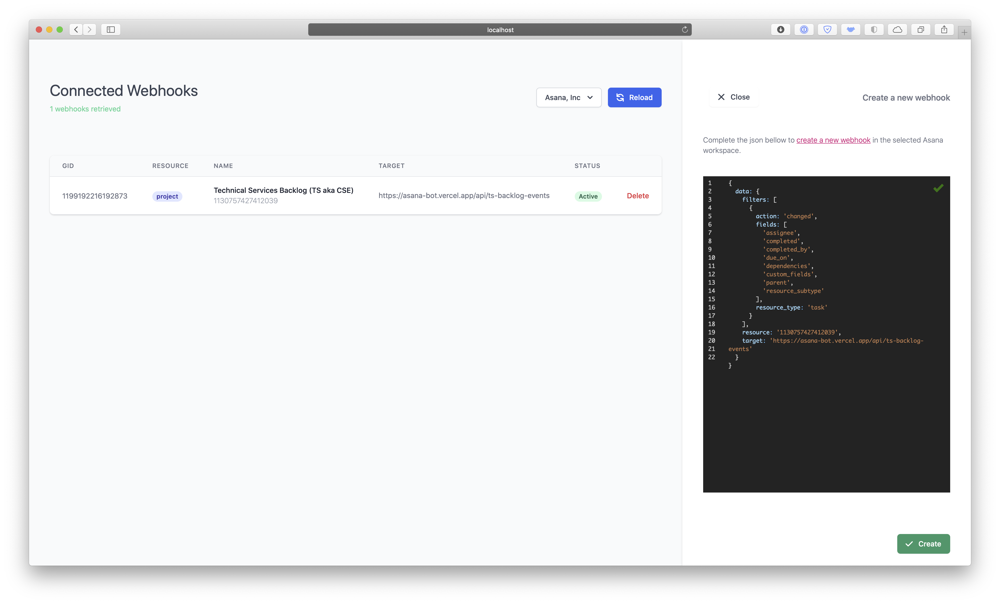

# 🤖 Asana Bot

A portal that manages automations and other scripts on [Asana](https://asana.com).

It was designed to cover my specific needs but can be used as a guide or starting point for your own requirements.

## Documentation

See the [Wiki](https://github.com/rubengarciam/asana-bot/wiki) for full documentation, guides and other information.
  
## Dependencies

This project uses the following external libraries 🙌 :

- [Axios](https://github.com/axios/axios)
- [Next.js](https://nextjs.org)
- [Tailwind CSS](https://tailwindcss.com) and [Headless UI](https://headlessui.dev)
  
[React](http://reactjs.org) specific libraries:

- [http-status-codes](https://github.com/prettymuchbryce/http-status-codes)
- [react-json-editor-ajrm](https://github.com/AndrewRedican/react-json-editor-ajrm#readme)
- [react-responsive](https://github.com/contra/react-responsive)
- [react-transition-group](http://reactcommunity.org/react-transition-group/)

It is designed to be deployed in [Vercel](https://vercel.com/home?utm_source=next-site&utm_medium=banner&utm_campaign=next-website).